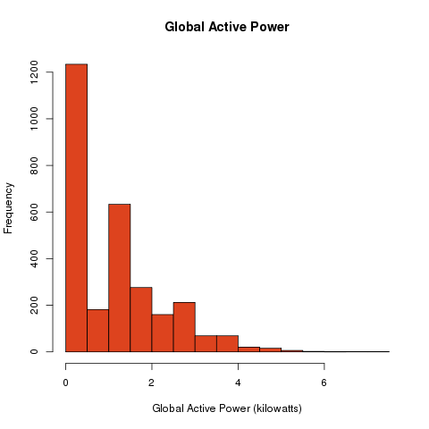
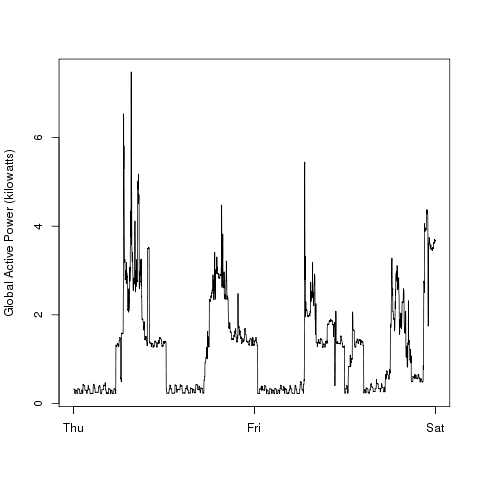
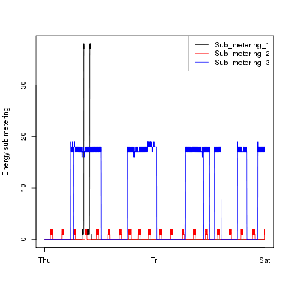
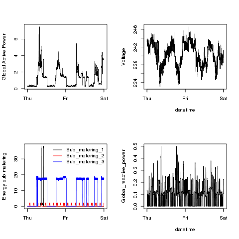

## Grading comparison for peer reviewers

For the four plots, it helps with checking to see the original sample figures alongside the completed ones.
Keep in mind that the figures used in the README.md file are at 504x504px not the required 480x480px.

#### Plot 1 - example
|
#### Plot 1 - submitted

#### Plot 2 - example

#### Plot 2 - submitted

#### Plot 3 - example

#### Plot 3 - submitted

#### Plot 4 - example

#### Plot 4 - submitted

